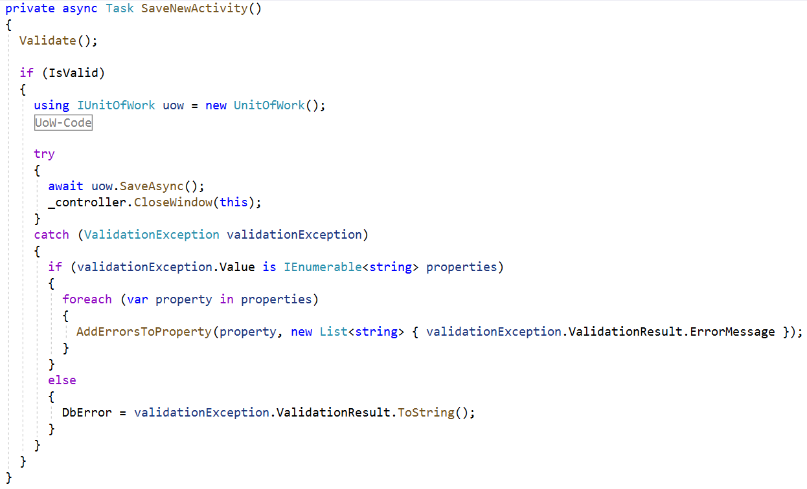

# WPF Validierung

## Validierung des `EmployeeViewModel`

### Vorname prüfen

### Nachname prüfen

### Allgemeine Überprüfungen

### Fehlermeldungen als Tooltip

### Ergebnis

## Validierung des `NewActivityViewModel`

### DB-Validierungen

#### Erweiterung des Kommandos zum Speichern:

#### Erweiterung der View (`NewActivityWindow.xaml`) -> DbError

#### Style für die Fehlerbeschreibung `ErrorCaptionStyle`

#### Erweiterung  `UnitOfWork`

### Ergebnis

